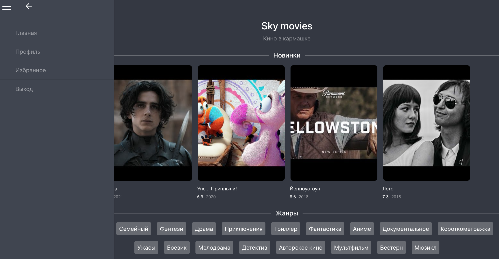

# Sky movies

Это сайт поиска фильмов. API взаимодействует с базой данных SQLite в процессе разработки и Postgresql на стадии production,
реализует аутентификацию пользователей и позволяет коллекционировать фильмы в избранном.

# Запуск

Для разработки необходимо запустить отдельно front и api по инструкциям внутри папок.

Для разворачивания на сервере следует воспользоваться docker-compose и workflows.

## Цель проекта

Код написан в образовательных целях и нацелен в основном на Flask и CI/CD.
