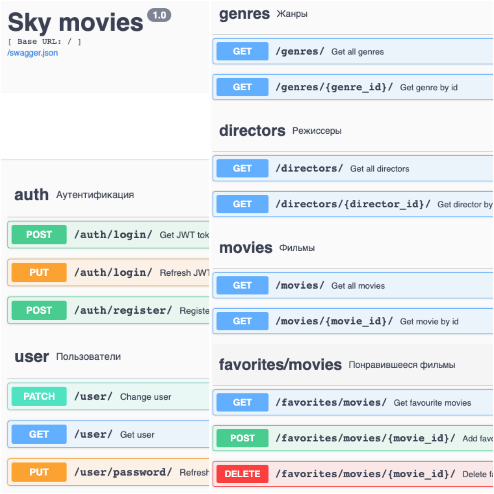

# Sky movies

Это backend для сайта поиска фильмов. API взаимодействует с базой данных SQLite,
реализует аутентификацию пользователей и позволяет коллекционировать фильмы в избранных.


Frontend находится [здесь](https://github.com/skypro-008/skypro_py_stand).

Документация API swagger находится по адресу [/docs](http://127.0.0.1:5000/docs)/



## Установка

Установите зависимости командой:

```sh
python -m pip install -r requirements.txt
python -m pip install -r requirements.dev.txt
```

Создайте Базу данных командой:

```sh
python create_tables.py
```

Загрузите данные из json командой:

```sh
python load_fixtures.py
```

## Запуск

API запускается на localhost:5000.

### Bash (Linux/MACOS)

```sh
export FLASK_APP=run.py
export FLASK_ENV='development'
python -m flask run
```

### PowerShell (Windows)

```sh
$env:FLASK_APP = "run"
$env:FLASK_ENV = "development"
python -m flask run
```

## Запуск тестов

```shell
python -m pytest .
```

## Цель проекта

Код написан в образовательных целях.
Исходный код взят [отсюда](https://github.com/skypro-008/coursework_3_source), шаги реализации описаны [здесь](https://skyengpublic.notion.site/4-ee227276cbde4b5b950c29772427b950).
